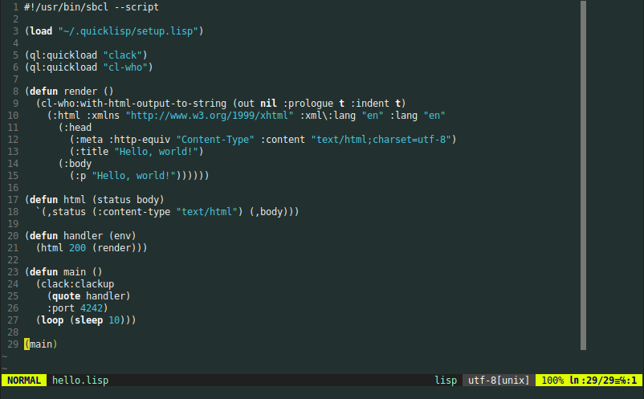

# vim-colors-plain

Minimalist colour scheme using just bold to highlight keywords and a single colour for literals.

## Installation & Usage

To install with [vim-plug][https://github.com/junegunn/vim-plug], add this line to your `.vimrc`:
```
Plug 'aronlebani/vim-colors-plain'
```
If you use a different plugin manager, consult the documentation for your plugin manager for more
information. Then to use the colour scheme, set:
```
set background=dark " Set to light for a light variant
colorscheme plain-cterm
```

## Screenshots


